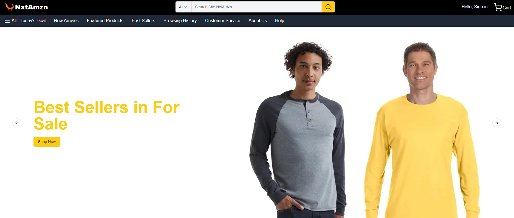

# Next Js - Amazon Clone

This is a [Next.js](https://nextjs.org) project bootstrapped with [`create-next-app`](https://nextjs.org/docs/app/api-reference/cli/create-next-app).

## Getting Started

First, run the development server:

```bash
npm run dev
# or
yarn dev
# or
pnpm dev
# or
bun dev
```

Open [http://localhost:3000](http://localhost:3000) with your browser to see the result.

You can start editing the page by modifying `app/page.tsx`. The page auto-updates as you edit the file.

This project uses [`next/font`](https://nextjs.org/docs/app/building-your-application/optimizing/fonts) to automatically optimize and load [Geist](https://vercel.com/font), a new font family for Vercel.

## Learn More

To learn more about Next.js, take a look at the following resources:

- [Next.js Documentation](https://nextjs.org/docs) - learn about Next.js features and API.
- [Learn Next.js](https://nextjs.org/learn) - an interactive Next.js tutorial.

You can check out [the Next.js GitHub repository](https://github.com/vercel/next.js) - your feedback and contributions are welcome!

## Deploy on Vercel

The easiest way to deploy your Next.js app is to use the [Vercel Platform](https://vercel.com/new?utm_medium=default-template&filter=next.js&utm_source=create-next-app&utm_campaign=create-next-app-readme) from the creators of Next.js.

Check out our [Next.js deployment documentation](https://nextjs.org/docs/app/building-your-application/deploying) for more details.


## Frameworks Installs

[Next Js](https://nextjs.org/)

[Shadcn](https://ui.shadcn.com/themes)

[Shadcn carousel](https://ui.shadcn.com/docs/components/carousel)

[Embla carousel autoplay](https://www.embla-carousel.com/plugins/autoplay/)

// or 

[Npm Embla carousel autoplay](https://www.npmjs.com/package/embla-carousel-autoplay)

[Tailwind](https://tailwindcss.com/)

[MongoDB](https://www.mongodb.com/)

[Mongoose](https://mongoosejs.com/)


<br>

# Progress project 




#

## Páginas do Sistema

### Página de Lojas (`/stores`)
A página de lojas físicas oferece uma experiência interativa para os usuários encontrarem e conhecerem nossas unidades:

#### Características Principais:
- **Carrossel de Imagens**: 
  - Exibição dinâmica das lojas com transições suaves
  - Navegação intuitiva com botões de anterior/próximo
  - Overlay semi-transparente para melhor legibilidade do texto
  - Imagens otimizadas para carregamento rápido

- **Localização das Lojas**:
  - Shopping Morumbi
  - Shopping Cidade São Paulo
  - Shopping Villa-Lobos
  - Informações detalhadas de cada unidade:
    - Endereço completo
    - Horário de funcionamento
    - Telefone de contato
    - Botões de "Como Chegar" e "Ligar"

- **Serviços Disponíveis**:
  - Compras na loja
  - Retirada de produtos
  - Serviços financeiros
  - Atendimento personalizado

- **Diferenciais**:
  - Ambiente moderno
  - Wi-Fi gratuito
  - Área de descanso
  - Cafeteria
  - Estacionamento

#### Tecnologias Utilizadas:
- `embla-carousel-react` para o carrossel de imagens
- Componentes responsivos do shadcn/ui
- Otimização de imagens com Next.js Image
- Design adaptativo para todos os dispositivos

#
